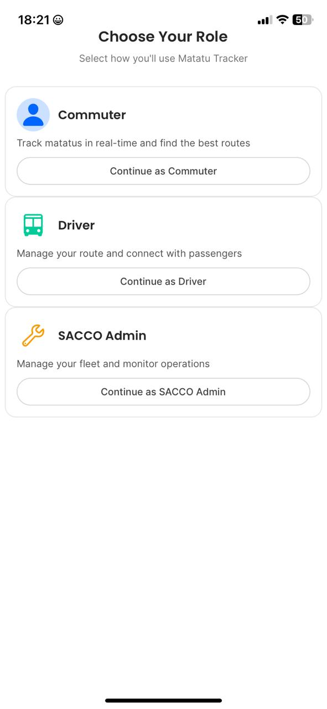
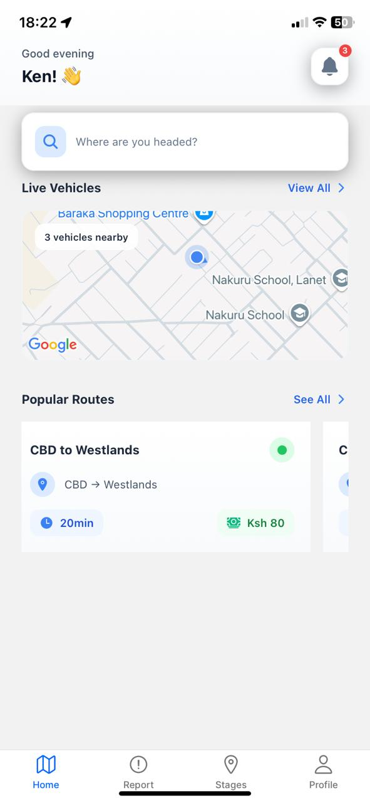
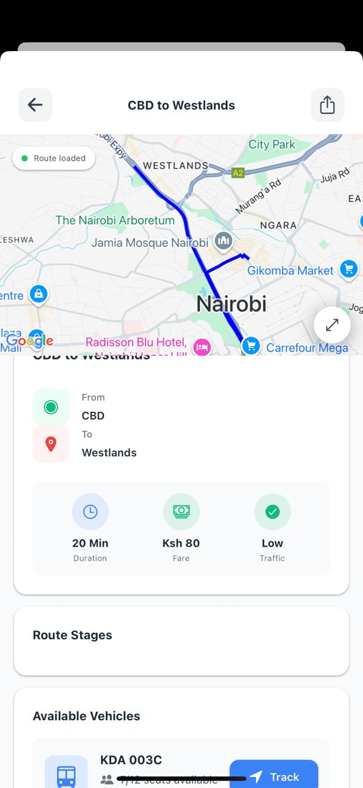
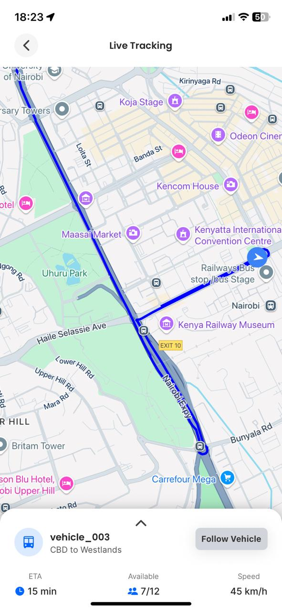

# 🚐 Twende

**Twende** is a Kenyan mobility app that helps users discover, track, and explore *matatu* routes and styles in real time. From graffiti-covered exteriors to booming sound systems, Twende maps out Nairobi’s matatu culture like never before.

---

## 🌍 Why Twende?

Kenya's matatus are more than public transport — they're urban art and culture on wheels. But navigating them can be confusing, especially for newcomers. **Twende** aims to:

- Help commuters find stylish, efficient, and safe matatus
- Showcase iconic matatus and their unique flair
- Make route planning smarter and more fun

---

## 📱 Features

- 🗺️ **Live Map Tracking** – Know where matatus are at any time
- 🎨 **Matatu Profiles** – View matatu names, graffiti, music genres, and interior vibes
- 🔔 **Arrival Alerts** – Stay updated on incoming matatus and ETAs
- 💬 **Rate Your Ride** – Share feedback about speed, music, vibes, and service
- 📍 **Nearby Stages** – Find the closest matatu pick-up points
- 🔍 **Search Routes** – Easily discover new destinations or common stages

---

## 🛠 Tech Stack

- **Frontend**: React Native + Expo
- **Backend**: Supabase (Database, Auth, Realtime)
- **Maps**: Google Maps API
- **Auth**: Supabase Auth
- **Storage**: Supabase Storage for media uploads

---

## 🖼 App Screenshots

Here’s a sneak peek into Twende:

  
  
  
  

---

## 🚧 Project Status

🛠 **In Development**

- MVP features are actively being built
- UI design and backend integration in progress
- Screens added ✅
- Live tracking and route logic: 🔄 WIP

Target Release: _Coming Soon_

---

## 🤝 Contributing

Pull requests are welcome! If you want to help shape the future of public transport in Nairobi:

1. Fork the repo
2. Clone locally
3. Create a feature branch
4. Push changes and open a PR

---

## 🙋‍♂️ Built By

Crafted by [Kennedy Gakuru](https://github.com/KennedyGakuru) 🇰🇪  
With inspiration from Nairobi streets, art, and the matatu madness we all love.

---

## 📄 License

MIT License — build your own ride.
